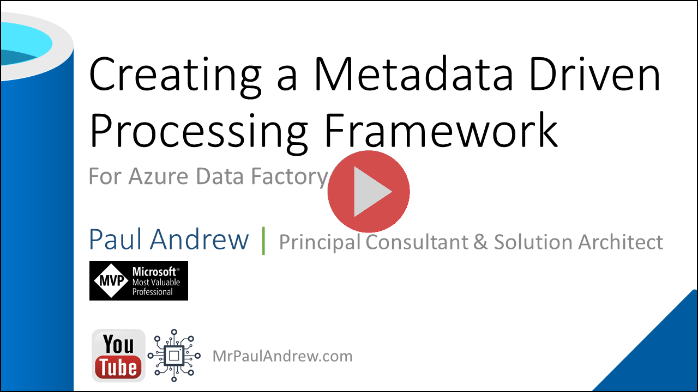

# Failure Handling

___
[<< Contents](/procfwk/contents) 

___

If a worker pipeline does not complete successfully the processing framework can take several different actions. This behaviour is configurable via the database [properties](/procfwk/properties). At runtime the framework uses these property values in various locations when updating the current execution table to indicate to the processing framework what to do next. The following outlines a set of options that can be supported.

The primary property that influences this behaviour is called __FailureHandling__. In the event of a worker pipeline is failure:

___

## Property Value: None

* Do nothing.

The pipeline status is updated to 'Failed' in the current execution [table](/procfwk/tables) and the framework carries on regardless.

Visually, the pipeline processing could be represented as follows:

___

## Property Value: Simple

* Stop processing and block all downstream [execution stages](/procfwk/executionstages).

The pipeline status is updated to 'Failed' in the current execution [table](/procfwk/tables). Then all downstream execution stages are marked as 'Blocked' and the processing framework is stopped after the stage where the failure occurred has completed any remaining Workers.

Visually, the pipeline processing could be represented as follows:

___

## Property Value: DependencyChain

* Allow processing to continue and only block affected downstream dependant worker pipelines.

The pipeline status is updated to 'Failed' in the current execution [table](/procfwk/tables). Then only downstream pipelines are marked as 'Blocked' (using the [DependantPipelineId] attribute in the PipelineDependencies table). Once done, processing is then allowed to continue. When the next execution stage starts only pipelines not blocked will get a status of 'Preparing' and be allowed to run. Finally, the [stored procedure](/procfwk/storedprocedures) [procfwk].[CheckForBlockedPipelines] will look ahead to the next execution stage and mark any further downstream dependant pipelines as 'Blocked', continuing the chain. For more details on creating a chain between worker pipelines in your metadata see [Dependency Chains](/procfwk/dependencychains).

Visually, the pipeline processing could be represented as follows:

___

These behaviours are also repeated using the following configured [properties](/procfwk/properties) where values are set to '1', meaning true.

* UnknownWorkerResultBlocks
* CancelledWorkerResultBlocks

In this context, an unknown worker pipeline status and a cancelled worker pipeline status are also treated as failures.

If these other pipeline status values have a property value set to '0', meaning false, the framework will simply accept the outcome and carry on. Then once all execution stages are complete the overall framework run will be accessed as successfully (all workers succeeded) or failed.

___

For demonstration of this behaviour please view the following YouTube video.

{:target="_blank"}

___